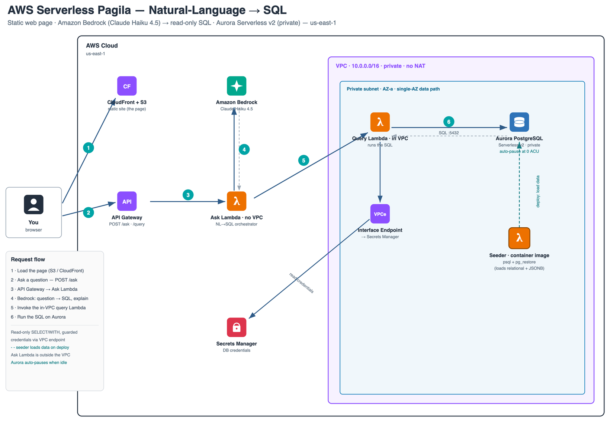

# Pagila — AWS Serverless Training Edition

A serverless deployment of the **Pagila** sample database (a DVD-rental store
schema) with a natural-language query front end, for practicing PostgreSQL on AWS
at minimal cost.

## Architecture



- **Web app:** a static page (**S3 + CloudFront**) where you type a question in
  plain English. It shows your request, the generated SQL, terminal-style
  results, a plain-English explanation, and an always-visible list of the tables
  and fields you can ask about.
- **Natural language → SQL:** an **Ask Lambda** (outside the VPC) calls **Amazon
  Bedrock** (Claude Haiku 4.5) to turn the question into a single **read-only**
  `SELECT`/`WITH`, runs it, then asks Bedrock for a plain-English explanation of
  the results. The generated SQL is guarded — read-only, single statement, with a
  `LIMIT` enforced.
- **Database:** Aurora PostgreSQL **Serverless v2** with scale-to-zero
  (auto-pauses when idle), **private** — no public endpoint.
- **In-VPC query path:** a **Query Lambda** (in the VPC) runs the SQL against
  Aurora and reads credentials from **Secrets Manager** through a single-AZ
  interface VPC endpoint (no NAT gateway). The Ask Lambda invokes it; it's also
  exposed directly as `POST /query` for raw SQL.
- **Seeding:** a one-time **container-image seeder** (a CloudFormation custom
  resource running `psql` + `pg_restore`) loads the schema, the relational data,
  and the two JSONB tables on deploy — nothing to run by hand, and it's
  idempotent.
- **IaC:** AWS CDK (TypeScript) in [infrastructure/cdk/](infrastructure/cdk/).
  Teardown leaves nothing behind: `RemovalPolicy.DESTROY` (no final snapshot)
  plus a customized bootstrap template that auto-expires build assets in S3/ECR.

**Request flow:** load page (S3 / CloudFront) → `POST /ask` → Ask Lambda →
Bedrock (question → SQL) → invoke the in-VPC Query Lambda → run SQL on Aurora →
Bedrock (explain) → request, SQL, rows, and explanation back to the browser.

## Quick start

Prereqs: an AWS account, AWS CLI configured, Node.js 18+, the AWS CDK
(`npx cdk`), and **Amazon Bedrock model access enabled** for Claude Haiku 4.5 in
your region. See [infrastructure/aws-setup-guide.md](infrastructure/aws-setup-guide.md).

```bash
cd infrastructure/cdk
npm install
npx cdk bootstrap --template bootstrap-template.yaml   # first time per account/region
npx cdk deploy               # creates everything AND seeds the database
```

When it finishes, open the **`SiteURL`** output in a browser and ask questions in
plain English. Or query the database directly with the **`APIEndpoint`** output:

```bash
API_ENDPOINT=<APIEndpoint output>   # e.g. https://xxxx.execute-api.us-east-1.amazonaws.com/prod/
curl -sS -X POST "${API_ENDPOINT}query" \
  -H "Content-Type: application/json" \
  -d '{"query":"SELECT title, rental_rate FROM film LIMIT 5;"}' | jq
```

Smoke-test the deployment:

```bash
API_ENDPOINT=<your APIEndpoint> python3 tests/integration-test.py
ASK_ENDPOINT=<your AskEndpoint output> python3 tests/ask-smoke-test.py
```

Tear everything down (stops all charges):

```bash
cd infrastructure/cdk && npx cdk destroy
```

More detail in [DEPLOYMENT_CHECKLIST.md](DEPLOYMENT_CHECKLIST.md) and
[USAGE_GUIDE.md](USAGE_GUIDE.md).

> **JSONB sample data:** the two `jsonb` tables
> (`packages_apt_postgresql_org`, `packages_yum_postgresql_org`) are PostgreSQL
> package metadata — a JSONB demo, **not** part of the rental-store schema. The
> seeder loads them on deploy (via `pg_restore` of the
> `pagila-data-*-jsonb.backup` archives) alongside the relational data.

## Example query

Find late rentals:

```sql
SELECT CONCAT(customer.last_name, ', ', customer.first_name) AS customer,
       address.phone, film.title
FROM rental
  INNER JOIN customer  ON rental.customer_id   = customer.customer_id
  INNER JOIN address   ON customer.address_id  = address.address_id
  INNER JOIN inventory ON rental.inventory_id  = inventory.inventory_id
  INNER JOIN film      ON inventory.film_id    = film.film_id
WHERE rental.return_date IS NULL
  AND rental_date < CURRENT_DATE
ORDER BY title
LIMIT 5;
```

Full-text search is built in (no `film_text` table needed):

```sql
SELECT * FROM film WHERE fulltext @@ to_tsquery('fate & india');
```

## About Pagila

Pagila is a port of the [Sakila](https://dev.mysql.com/doc/sakila/en/) example
database (originally by Mike Hillyer of the MySQL AB documentation team),
intended as a standard schema for examples, tutorials, and articles. It targets
PostgreSQL 12+. Notable differences from Sakila:

- `char(1)` true/false fields became real booleans
- `last_update` columns are maintained by triggers
- foreign keys added (and pointless `DEFAULT 0` on FKs removed)
- PostgreSQL built-in full-text search (no `film_text` table)
- `rewards_report` ported to a simple set-returning function
- JSONB sample data added

The `payment` table is partitioned by month. Pagila is made available under the
PostgreSQL license.

## Data files

- `pagila-schema.sql` — schema (tables, views, functions, triggers)
- `pagila-schema-jsonb.sql` — the two JSONB tables
- `pagila-data.sql` — sample data using `COPY` (loaded by the seeder)
- `pagila-insert-data.sql` — same data as `INSERT`s (kept for reference / `psql` use)
- `pagila-data-*-jsonb.backup` — JSONB data for `pg_restore` (loaded by the seeder)
